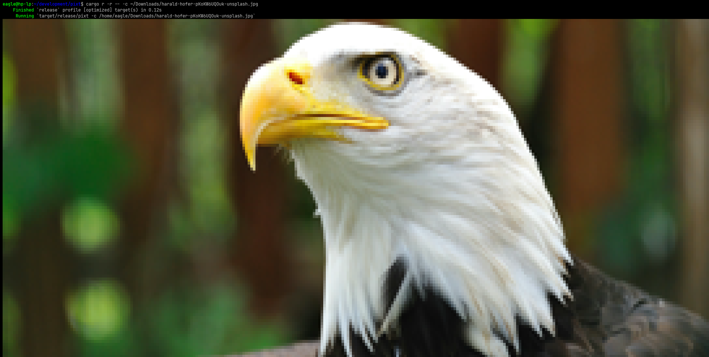
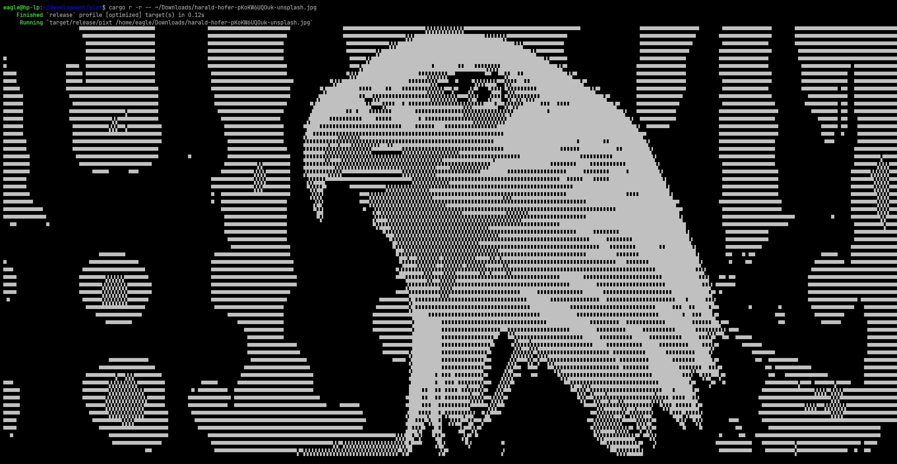
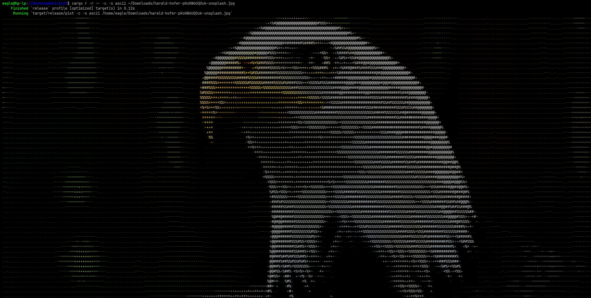
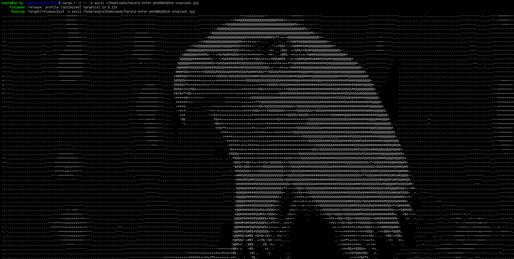
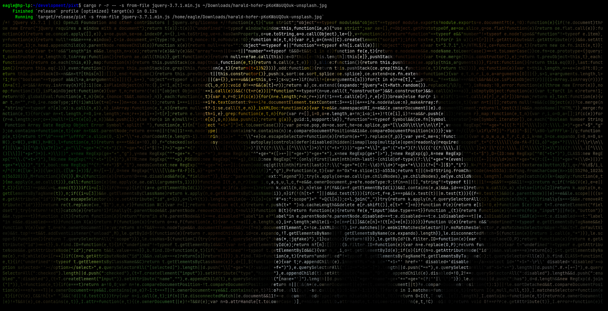
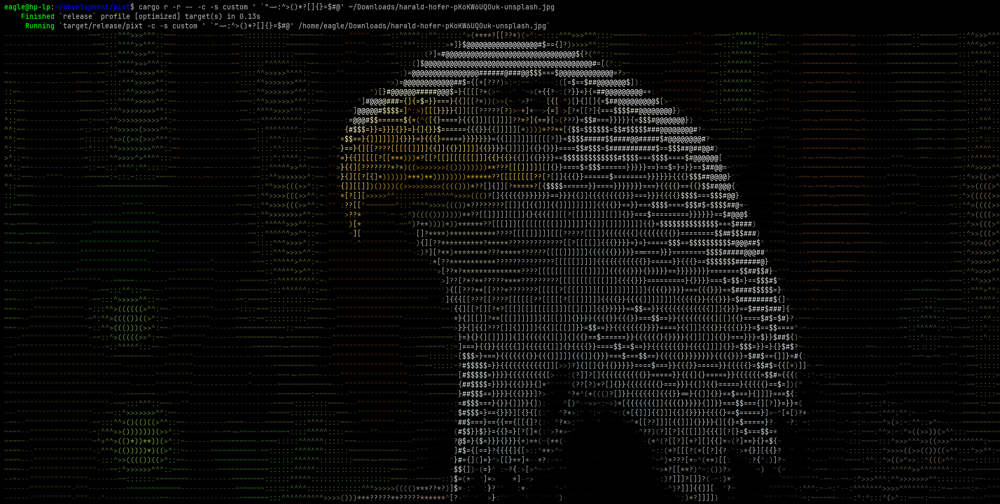
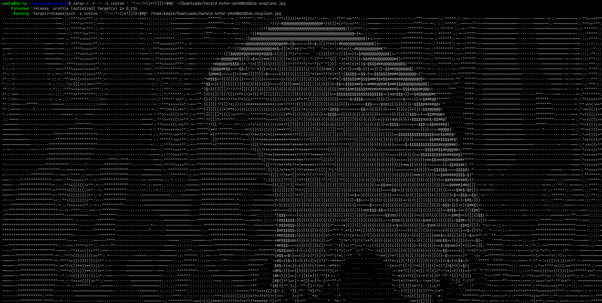
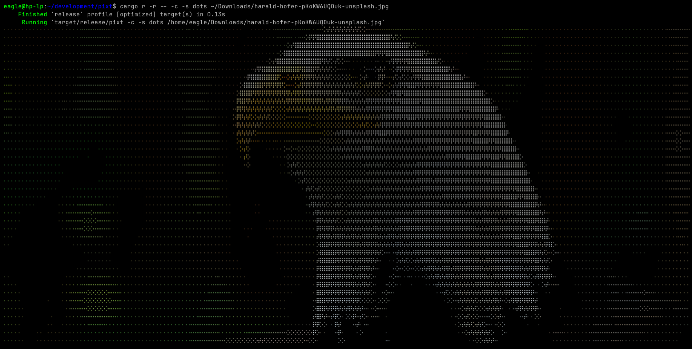
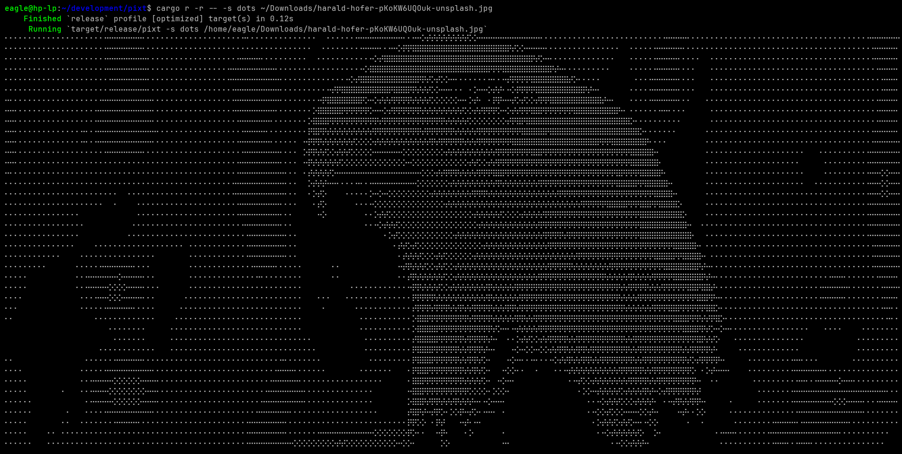

# pixt - Image to ASCII Art

`pixt` is a command-line and web based tool for converting image to ASCII art with various styles, including pixel-based, ASCII, block, and braille.

## TODO

- [x] Terminal output
- [x] HTML output
- [ ] SVG output 🚧

## Installation

### Using Cargo

```bash
cargo install pixt
```

### Build from Source

```bash
git clone https://github.com/BiswajitThakur/pixt.git
cd pixt
cargo build --release
./target/release/pixt --help
```

## Help

```
Usage: pixt [OPTIONS] [FILES]...

Arguments:
  [FILES]...  Input file paths

Options:
  -w, --width <WIDTH>    Output width in terminal characters
  -H, --height <HEIGHT>  Output height in terminal characters
  -c, --colored          Enable colored output
  -s, --style <STYLE>    Style of Output Image [default: pixel] [possible values: pixel, ascii, block, braills, dots, custom, from-file]
  -o, --output <OUTPUT>  Optput
  -h, --help             Print help
```

## Examples

#### Default with `-c` or `--colored` flag

```bash
pixt -c <path of image>
```



#### Default (without any flag)

```bash
pixt <path of image>
```



```bash
pixt -c -s ascii <path of image>
```



```bash
pixt -s ascii <path of image>
```



```bash
pixt -s from-file <file> <image-path>
```



```bash
pixt -c -s custom ' `"-~:^>()*?[]{}=$#@' <path of image>
```



```bash
pixt -s custom ' `"-~:^>()*?[]{}=$#@' <path of image>
```



```bash
pixt -c -s dots <path of image>
```



```bash
pixt -s dots <path of image>
```



## License

This project is licensed under the [MIT](./LICENSE) License.

## Contributing

Feel free to open issues or submit pull requests!
